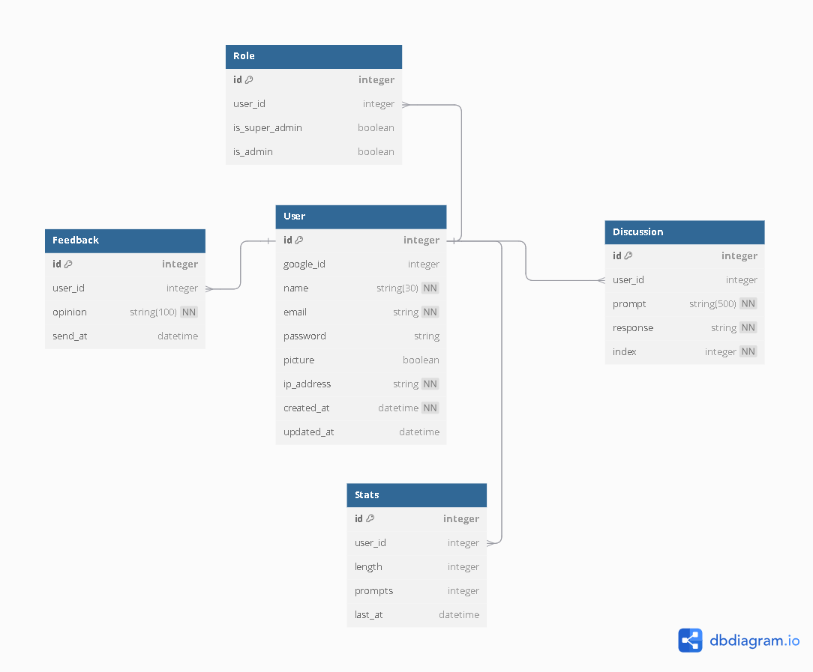

# Introduction
Hello and welcome to this repo which is a webapp about an ai chatbot integrated with SLM(Small Language Model) for short chating purposes.<br>
Its the idea of the frontend developer <a href="github.com/Nxwfel">Nawfel</a>.<br>
The Backend developer and Data Scientist is <a href="github.com/AmeUr56">Ameur</a>.

# Frontend

# Backend
Python and its libraries are used for the backend section,here is summary:

#### Environment Variables:
OS and Dotenv are used for securing and retreving senstive data.

#### Jinja2
For Dynamic Templates(HTML) jinja2 template engine language is used for:
- loops
- temporelle variables
- if statements
- ...

#### Restful API:
**Flask** and its extentions:
- sqlalchemy
- migrate
- login
- wtf
- admin
- bcrypt
- caching
- limiter

#### Visualizations:
Data Science libraries like **Pandas**, **matplotlib**, **seaborn** and **PIL**. 

#### Database
**SQlite** is used with **sqlalchemy** and its flask extention for interacting with the database.

#### SLM
<a href="https://huggingface.co/Qwen/Qwen2.5-1.5B-Instruct">Qwen/Qwen2.5-1.5B-Instruct</a>

#### Socket.IO API
**Flask-socketio** is used in backend and **Javascript socketio** pachage in frontend.

## Detailed Explanation
### Environment Variables
- **Dotenv** is used for storing the keys and sensitive infos.
- **OS** is used for retreving these infos securely.

### Endpoints (Restful API)
- **Flask** is used for defining endpoints with two request methods:
    - **GET**: to get resources(HTML Templates,Images,...) from the backend.
    - **POST**: to send resources(Usernames,Passwords,..0) to the backend.

- **Endpoints**:
    - **/**: Homepage route with GET requet only.

    - **/signup**: Signup process with **GET request** to retrieve Signup.html, Login.css,Images related to this HTML template.
    and **POST request** to submit this form <Link to Signup Form>

    - **/login**: Login process with **GET request** to retrieve Login.html, Login.css,Images related to this HTML template.
    and **POST request** to submit this form <Link to LoginForm Form>

    - **/logout**: Logout process with **POST request** only to submit this form <link to Logout Form>

    - **/feedback**: With only **POST request**Let users send thier feedbacks using this form <link to FeedbackForm>

    - **/profile**: Profile page with **GET request** to retreive Profle.html, Profile.css, Image related to this template.
    and **POST request** for updating the profile credentials using this form <link to ProfileForm>
    and using Caching for the user's data for 30 seconds only.

    - **/clear_discussion** Using **POST request** for clearing the discussion with submiting this form <link to ClearDiscussionForm>

### Flask App Addons
- **ErrorHandler** shows error.html template for any error.
- **underscore_separate** a jinja2 filter that splits string based on underscore "_".
- **get_att** also jinja2 filter that takes class or entity and name of attribute and returns the value of the attribute in this class or entity.

### Optimization and User Experience Enhancements
#### Limiting
- **Flask-limiter**: is used for limiting endpoints access for each user based on its ip_address.

- **Endpoints with Limiting**:
    - **/**: 5 requests permited per second.
    - **/signup**: 1 per second.
    - **/login**: 1 per second.
    - **/logout**: 3 per second.
    - **/feedback**: 1 per second.
    - **/profile**: 5 per second.
    - **/clear_discussion**: 1 per second.

#### Caching
- **Flask-Caching**: is used for caching data to reduce the need for repeated database queries or expensive computations.

- **Endpoints with Caching**:
    - **/profile**: caching is applied only to the function for 30 seconds that queries and retreives data of the user to avoid expensive computations for each request.

####  Flashing
- **flash** function from flask is used for temporarelly storing the messages and then showed by **get_flashed_messages** function.

### Forms
- **flask_wtf** and **wtforms** are used for accepting data from user side and then transimit it to the backend side.

- **Forms Used**:
    - **SignupForm** for singup operation.
    - **LoginForm** for login operation.
    - **LogoutForm** for logout operation.
    - **FeedbackForm** for feedback operation.
    - **UpdateProfileForm** for updating user credentials.
    - **ClearDiscussion** for clearing discussion with the ai bot.

#### Admin's Forms
- **CreateUserForm** to create new user.
- **EditUserForm** to edit credentials of existing user.

- **CreateRoleForm** to create new role for existing user.
- **EditRoleForm** to edit roles.

- **CreatePictureForm** to create profile picture for existing user.

- **FilterForm** to filter entity's tuples based on user_id.
- **Delete**  to delete entity's tuple.
- **DateRange** to take date range for the signups visualization.

- **Preveting Spaming and Bots**: Honeypot and time based fields are used.

#### See Forms.py for more details

### Database
- **Flask-migrate** is used for creating db and handling its schema.
- **Flask-sqlalchemy** as an **ORM** for CRUD operations form the db.

#### ER Diagram


#### See Models.py for more details

### Authentification
- **Flask-Login** is used to diffrentitiate between authnticated users and nons and endpoints access and other useful utilities.<br>
Nothing Special just standard things.

#### Google OAuth

### SLM
Qwen2.5-1.5B-Instruct by Qwen

#### Capabilities
- Long-context Support up to 128K tokens.
- Generating long texts (over 8K tokens).
- Understanding structured data (e.g, tables).
- Generating structured outputs especially JSON.
#### Architecture
- **Type**: Causal Language Models
- **Training Stage**: Pretraining & Post-training
- **Architecture**: transformers with RoPE, SwiGLU, RMSNorm, Attention QKV bias and tied word embeddings
- **Number of Parameters**: 1.54B
- **Tensor type**: BF16
- **Number of Paramaters (Non-Embedding)**: 1.31B
- **Number of Layers**: 28
- **Number of Attention Heads (GQA)**: 12 for Q and 2 for KVC
- **ontext Length**: Full 32,768 tokens and generation 8192 tokens
#### Requirements
- **Inference** Approximately 3 GB of RAM.

### Events(Socket API)
- Socket.IO API is bi-directional communication so:
    - **Flask-socketio** is used for handling the backend side.
    - **JS socket.io** is used for handling the frontend side.

- **Events**:
    - **connects** when user connects to this api.
    - **send_message** receives message from user and then emit the ai response word by word to the frontend.
    - **disconnect** when user disconnects from this api.

### Visualizations
- **Pandas**: is used for processing the data.
- **Matplotlib & Seaborn**: are used for Visualization of the data and saving it if needed.
- **PIL**: is used to process images like Profile Pictures or Visualizations.

# Installation & Usage
### 1. Install Required Libraries
```pip install -r requirements.txt```
### 2. Enter Echo-Chatbot Directory and Run 
```python run.py```
### 3. Open Browser and Type this URL
```localhost:5000```

# Deployment
- **gunicorn** is used for deployment.

# Contact
For any Questions or Collaborations contact us on:
## Ameur
- <a href="https://www.linkedin.com/in/ameur-b-25a155247?utm_source=share&utm_campaign=share_via&utm_content=profile&utm_medium=android_app">Linkedin</a>
- <a href="https://x.com/ame44i?t=al4XV8KZEK6R9Y0zpxPS8g&s=09">X (Twitter)</a>

## Noufel
-
-
-

# License
This web app is licensed under the [MIT License](./LICENSE.md).  
Copyright (c) 2024 [Ameur & Noufel].
